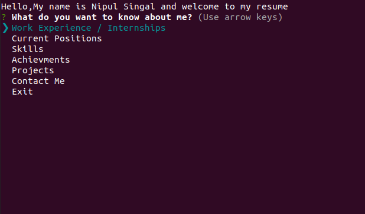
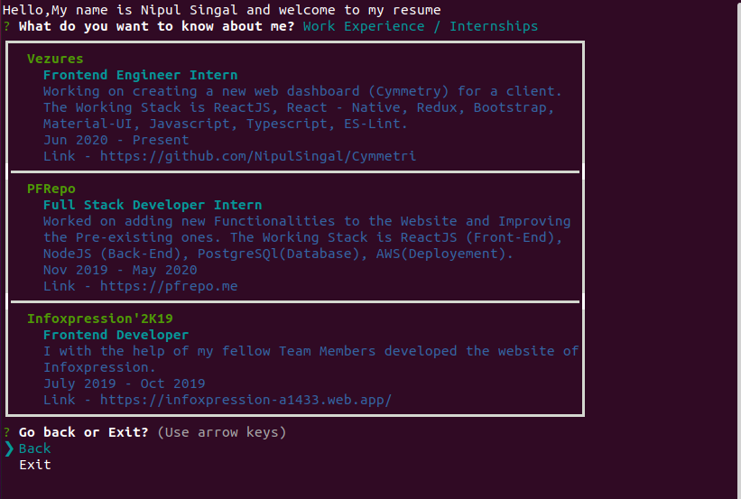
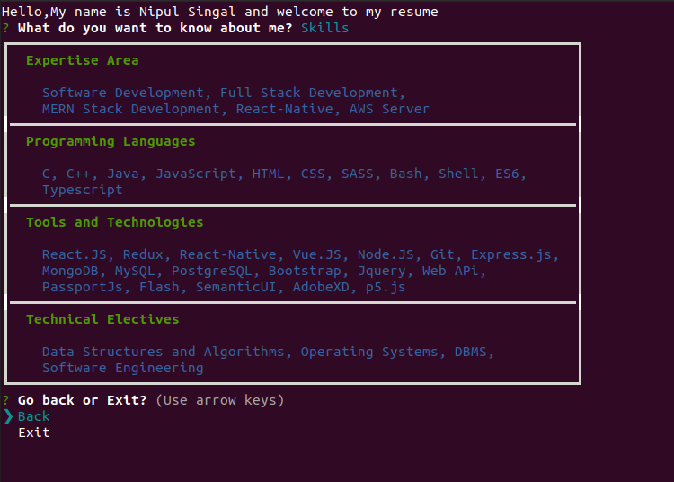
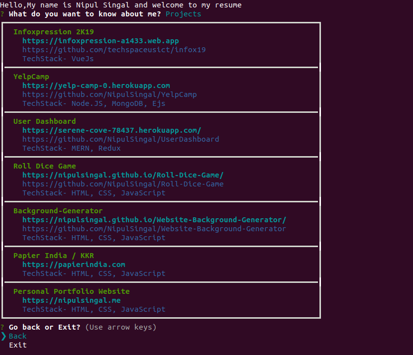
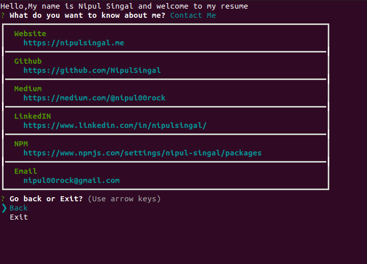

<h1 align="center">Resume | NPM</h1>
<h3 align="center"> Run <b>"npx nipul-singal"</b> in your terminal </h3>

<h2 align="center"><a href="https://www.npmjs.com/settings/nipul-singal/packages">Visit Package</a></h2>

## Setup -

> Open your terminal and run the command <b>npx nipul-singal</b>

## Glimpses

## Work Experience Screen 👓

## Skills Screen 👓

## Projects Screen 

## Contact Screen 👓

> Copyright to NipulSingal.
